class: inverse, center, middle

<center>
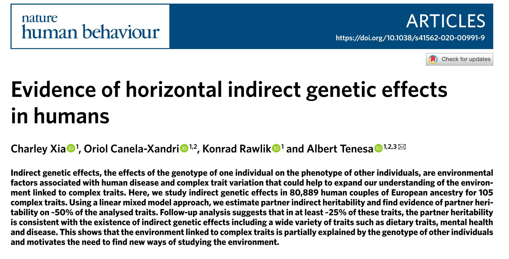
</center>

---

## Introduction

- **Indirect genetic effects (IGEs)**: the effect of a genotype of one individual on the phenotype of other individuals.

- **Vertical IGEs**: IGEs across generation.
  - For example, maternal genetic effects on their offspring phenotypes (such as birthweight).
  - Non-transmitted parental genotypes have also been described to influence offspring phenotypes (e.g. educational attainment).
  - Suggest vertical IGEs can be mediated through both *biological* and *social beahviors*.
  
- **Horizontal IGEs**: IGEs within generation. 
  - Reported for school friends in relation to educational attainment.
  - Unknown how much these observations are spread across traits, particularly in *partners* and *siblings*.

---

## Objectives and study overview

- Search for evidence of IGEs in UKB couples: 
  - 105 complex traits. 
  - In 80,889 couples. 
  - European ancestry. 
- Replication:
  - In 8,144 sibling pairs of European ancestry.
  - 3,752 couples of mixed ancestry (one European and the other non-European).
- Linear Mixed Model (LMM) approach to estimate **Partner indirect heritability** ( $h^2_{Partner}$ ): proportion of phenotypic variance observed for individuals that is explained by the additive genetic effect of their social partners.
- **Traits studied**: anthropometric traits, lifestyle choices, mental heath and late-onset diseases. 
- **Demonstrate**: $h^2_{Partner}$ captures IGEs beyond just assortative mating.
- ~50% of traits had a significant $h^2_{Partner}$ (this could be simply AM) and about ~25% of those showed evidence of IGEs. 

---

## Couple definitions

- As described previously in:
```{r, out.width='50%', fig.align='center', fig.cap='', echo=F}
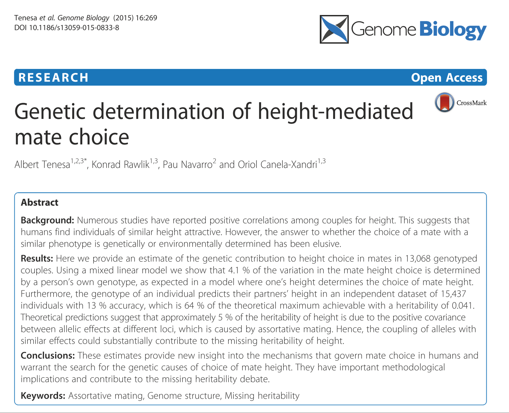
```
- 138 couple pairs with a genomic coefficient of relationship above 0.025 were removed.
- 7 related couples (for example, two couples made up of two relatives from one family and two relatives from another family) were removed also from analysis *(we did not apply this filter)*.
- Resulting in **80,889** couples for discovery.

???

*Tenesa, A., Rawlik, K., Navarro, P. & Canela-Xandri, O. Genetic determination of height-mediated mate choice. Genome Biol. 16, 269 (2016).*

So far we have not created a discovery set nor did we removed related couples. 

---

## Maximum-likelihood analysis

- Estimated proportion of phenotypic variation explained by individuals' own + partner's genotype, respectively. 

- Used genomic restricted maximum-likelihood (GREML) analyis is DISSECT. 

- The main **model** takes the following form: 

$$
\begin{aligned}
\textbf{y} &= X\beta + \textbf{g}_o + \textbf{g}_p + \varepsilon
\end{aligned}
$$


- Where:
  - $\textbf{y}$ = vector of phenotypes
  - $\textbf{X}$ = design matrix of fixed effect B
  - $\textbf{g}_o$ = effect of the individual's own genotype
  - $\textbf{g}_p$ = effect of the partners genotypes 
  - $\varepsilon$ = residual effect
  - $\textbf{g}_o$, $\textbf{g}_p$ and $\varepsilon$ are random effects.
  
---


## Maximum-likelihood analysis

- **Fixed-effect covariates**:
  - sex + 
  - genotype batch + 
  - assessment centre + 
  - age + age-squared + 
  - PC 1-20

- **Model interpretation**: 
  - Proportion of phenotypic heritability explained by individuals' own genotype: 
  
    $$h^2_{Own} =  \dfrac{\sigma^2_{o}}{\sigma^2_{o} + \sigma^2_{p} + \sigma^2_{\epsilon}}$$

  - Proportion of phenotypic heritability explained by individuals' partner's genotype:
  
    $$h^2_{Partner} =  \dfrac{\sigma^2_{p}}{\sigma^2_{o} + \sigma^2_{p} + \sigma^2_{\epsilon}}$$


---

## Maximum-likelihood analysis

- **Statistical test**: 
  - For each trait, tested against two null hypotheses. 
  - $\sigma^2_{o}= 0$ and $\sigma^2_{p} = 0$. 
  - Likelihood ratio test against the appropriate reduced model. 
  - Two component mixture, a delta spike at 0 and $\chi^2_{d.f.=1}$.
  - Each component with probability of 0.5 as null distribution using DISSECT. 

- **Sex-specific analysis**:
  - Fitted sex-specific models for sex-specific phenotypes. 
  - Fitted sex-stratified models for non-sex-specific phenotypes with estimates of $h^2_{Partner}$ significant with *P* < 0.05. 
  
- **Couple-shared phenotype**: $h^2_{Male}$ and $h^2_{Female}$ were defined as SNP-heritability contributed by male genotype and female genotype, respectively. 

---

## Prediction and replication:

- Learned the marker effects in 80K, EU couples.

- Used  the direct PGS ( $\hat g_{o}$ ) and indirect PGS ( $\hat g_{p}$ ) of sibling and mixed-couples in DISSECT.

- *Non-binary traits*. Pearson correlation between phenotype and predictions, comparing Cor (${y}$, $\hat g_{o}$)  with Cor( ${y}$, $\hat g_{o}$ + $\hat g_{p}$), to see if including partner IGEs increases correlation.  

- *Binary traits*. Prediction accuracy assessed with ROC curves using AUC statistic. Comparing model with and without $\hat g_{p}$. 

- *Couple and sibling replication analysis*. Attempted to remove correlations due to own and partner's direct genetic effects on focal phenotype and partner's focal phenotype. Conservative approach as it removes IGEs mediated through the same trait.

---

#### Couple and sibling replication analysis.

```{r, out.width='80%', fig.align='center', fig.cap='', echo=F}
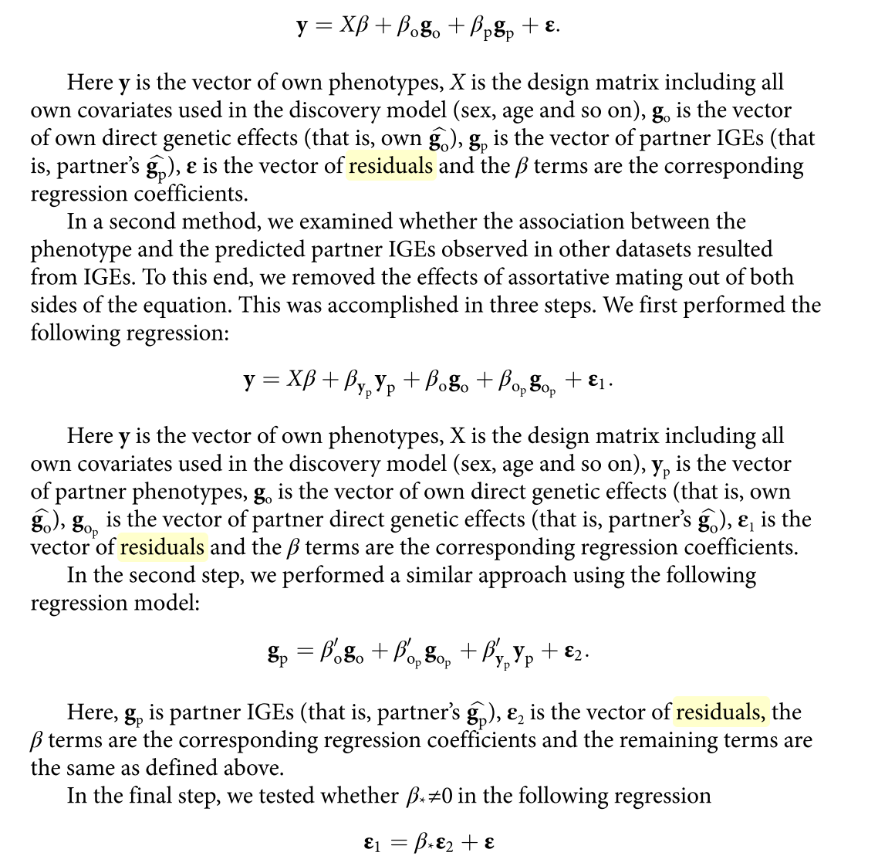
```

---


## Results: Evidence for partner indirect heritability

- Estimated $h^2_{Partner}$ for **91** traits expressed in women and men. 
- 28 (31%) found to have $h^2_{Partner}$ BF sig (*P* < 105; 105 total traits tested including sex-specific traits).
- 6/6 anthropometric traits.
- 11/18 dietary trait were categories most enriched. 
- Other notable significant traits: 
  - Educational attainment
  - Time spent watching TV
  - Smoking status
  - Disease and mental-health related traits. 
- Given traits are correlated, also applied FDR threshold, and 47 traits pass significance. 
- Used *P* < 0.05 as threshold for inclusion in downstream analyses, comprising 51 traits. 

---

## Table 1

```{r, out.width='100%', fig.align='center', fig.cap='Table 1 (abbreviated)', echo=F}
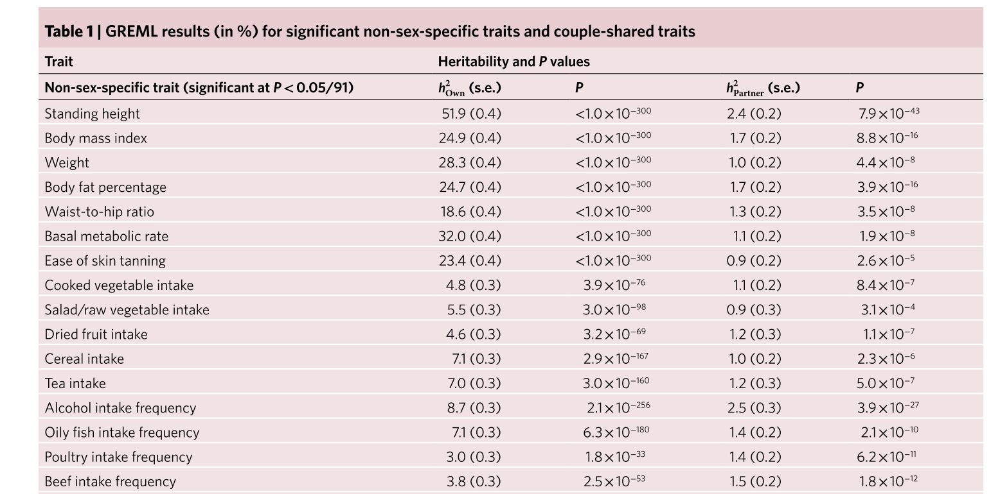
```

---
  
#### Figure 1

```{r, out.width='60%', fig.align='center', fig.cap='', echo=F}
knitr::include_graphics('./images/Figure1.png')
```

Estimates of direct ( $h^2_{Own}$ ) and indirect ( $h^2_{Partner}$ ) genetic effects in couples for 91 traits expressed in females and males. Each dot represents a trait. The blue dots represent traits with a significant estimate of $h^2_{Partner}$ (*P* < 0.05) and the blue dotted line shows the associated linear trend line. The grey dots represent traits with a non-significant estimate of $h^2_{Partner}$ and the grey dotted line shows the associated linear trend line. Liability-scale heritability is shown for binary traits.

---

## Results: Evidence for partner indirect heritability

- The variance explained by the partner genotype mainly came from the environment of the individual (that is, from the environmental residual variance)

- Whereas the estimate of individuals’ own genetic variance was largely unchanged compared to the base model containing only the person’s genotype.

- Also found that, generally, including the partner’s genotype in a prediction model improved prediction accuracy


???

(Supplementary Fig.2)

---

## Results: Differences between sexes

- Restricting to only 51 nominal traits.
- Found that $h^2_{Partner (Female \to Male)}$ was significantly larger than $h^2_{Partner (Male \to Female)}$ for 6 traits. 
- Mainly dietary- and obesity-related traits such as cereal intake (P = 3.89 × 10−3), beef intake frequency (P = 9.45 × 10−3) or waist-to-hip ratio (P = 5.53 × 10−5). 
```{r, out.width='90%', fig.align='center', fig.cap='Figure 2', echo=F}
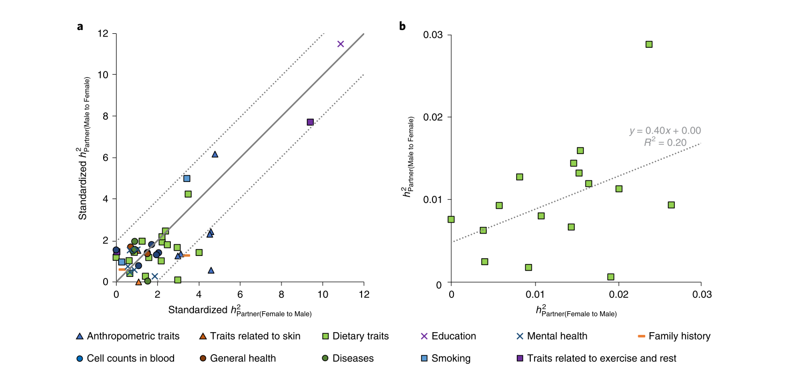
```

---

## Results: Differences between sexes

- No evidence of partner contribution on sex-specific diseases.
- Found significantly different estimates between male and females on couple-shared traits (e.g. number of children).

```{r, out.width='100%', fig.align='center', fig.cap='', echo=F}
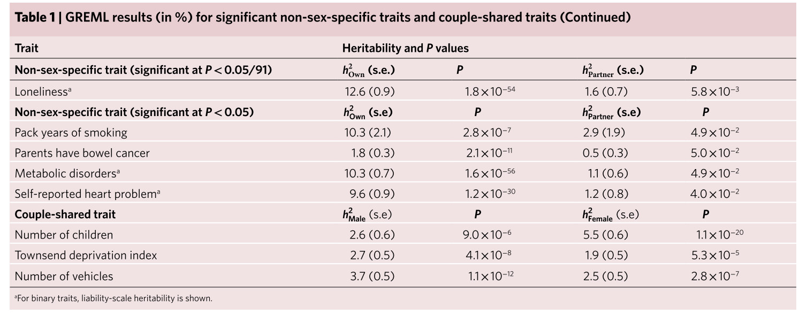
```

---

## Results: IGES under assortative mating

- Definitions: 
  - **Direct assortative mating**: assortment based on trait of interest.
  - **Indirect assortative mating**: assortment based on traits other than the trait of interest. 
- Sought to assess to what degree the observed $h^2_{Partner}$ could be explained by a model that does not invoke the existence of IGEs:
  1. Assessed the fit of the data to theoretical predictions under a pure model of assortative mating where $h^2_{Partner}$is generated exclusively though direct assortment. 
  2. Used permutations to estimate the expected $h^2_{Partner}$ in the European couples under the same strength of assortment. 
  3. Examine whether the IGEs learned in EU couples also explained variation in other ancestries and siblings. 

- Performed meta anlaysis of all results. 

---

## Results: Theoretical expectation of the partner heritability under direct assortative mating.

- Under direct assortative mating, the expectation is: $h^2_{Partner} = r^2_{CP}h^2_{Own}$. 

- Inflated values of $h^2_{Partner}$ compared to theoretical imply partner genotypes explain **more** than under direct assortative mating.

- Among the 51, 29 deviated for theoretical (*P* < 0.05). 

- Most  significant were educational attainment, time spent watching tv and smoking status.

- Simulations suggest that estimates are explained by models involving a combination of direct assortative mating **and** IGEs. 

???

Don't defined r2cp (assuming it's correlation of traits in couples)

---

## Results: Partner heritability in randomized couples with similar strength of assortment.

- Again under direct assortative mating on the focal trait, randomizing couples but keeping similar $r^2_{CP}$ should recapitulate the estimates of $h^2_{Partner}$. 

- Tested the within-trait differences between these permuted couples couples compared to the real couples. 

- Found marginally significant difference for 14 traits (*P* < 0.05).

- Most  differentiatied traits were time spent watching tv, smoking status and educational attainment.

- On average, estimates were 40% less in the randomized couples that in the real couples. 

???

This permutation is biased towards discovering cases where the focal traits are mediated through an uncorrelated trait. When the mediator of IGEs is correlated with the focal trait (for example, the same trait), the permutation is unable to break down the correlation structure made up by assortment and IGEs, thus making it hard to detect those traits and to separate them from direct assortment (Supplementary Fig. 3). As a consequence, the permutation results are probably conservative and underesti- mate the number of traits affected by IGEs.

---

## Results: Evidence of IGEs over the expectation under assortative mating.

```{r, out.width='120%', fig.align='center', fig.cap='Figure 3.', echo=F}
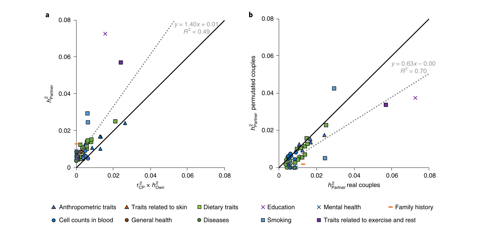
```


---

## Results: Replication in couples and evidence of IGEs in siblings.

- For the 51 traits, estimated best linear unbiased prediction (BLUPs) of the marker effect for both the direct and indirect effects using DISSECT.
- BLUPs were used to predict direct and indirect PGSs of non-EUR couples and sibling pairs. 
- Found partner indirect PGS was marginally significant with 19 out 51 traits. 
- Also removed correlations due to own and partner’s direct genetic effects on the focal phenotype as well as partner’s focal phenotype (i.e. removing effects of assortment). *This is a conservative approach, since it would also remove IGEs if they are mediated through the same trait.*
- In siblings, found that couple-estimated indirect PGS was marginally significant in 8 out of 51 traits. These could be due to vertical IGEs in parents captured by proxy.

---

## Results: Evidence of IGEs under assortative mating across follow-up analyses.

- Combined all 4 results by meta-analysis using Fisher's method:

  1. Estimate of $h^2_{Partner}$ in real couples deviates from theoretical expectation. 
  2. Estimates of $h^2_{Partner}$ in real couples is different from permuted couples
  3. Evidence of IGEs on top of assortment in mixed couples. 
  4. Evidence of IGEs on top of assortment in siblings. 
  
- Used BF correction (# of tests = 51)

- 13 traits significant evidence of IGEs. 

---

## Theoretical and simulation study

- Derived expectation of $h^2_{Own}$ and $h^2_{Partner}$ and $r^2_{cp}$ under different scenerios.
- Considered a model under two general configurations:
  1. Direct assortative mating on the trait affected by IGEs (e.g. BMI under assortment and affected by dietary preferences). 
  2. Indirect assortative mating through assortment on the trait mediating IGEs (e.g. social economics status under assortment and affecting disease risk).
```{r, out.width='80%', fig.align='center', fig.cap='', echo=F}
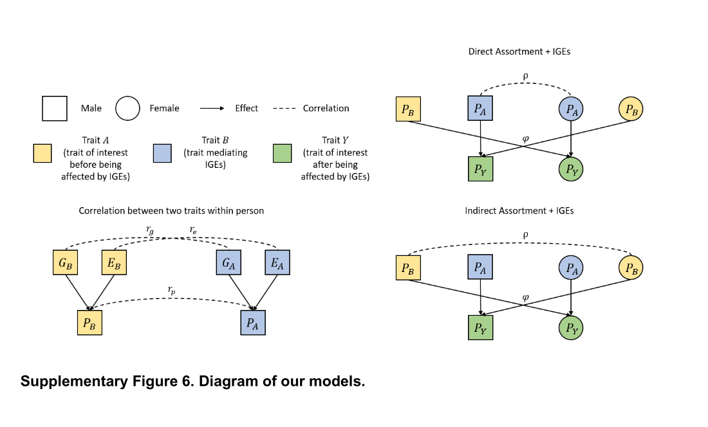
```

???

We considered a model under two general configurations, direct assortative mating on the trait affected by IGEs (e.g. BMI under assortment and affected by dietary preferences) or indirect assortative mating through assortment on the trait mediating IGEs (e.g. social economics status under assortment and affecting disease risk). Our objective is to obtain an analytic expression for $h^2_{Own}$, $h^2_{Partner}$, and $r_{cp}$ , under different assumptions, which we will then compare with empirical results. The models are summarised in Supplementary Figure 6 (below).

To this end, we define a model with three traits. The trait of interest, Py, and two intermediate traits: Pa andPb which would be the trait affected by IGEs and the trait mediating IGEs, respectively (see Fig. S1). These intermediate traits are a composed of a genetic and an environmental component: P = G + E. For example, the phenotypic value of partner 1 would be: Py = Pa + phi(Pb)

---

## Theoretical and simulation study

- Derived expectation of: 
  - $h^2_{Partner}$
  - $h^2_{Own}$
  - $r_{cp}$
- In different scenarios, covering: 
  - Direct vs. indirect assortment. 
  - Presence vs absence of IGEs. 
  - Combination of these. 

```{r, out.width='100%', fig.align='center', fig.cap='Table 1 (abbreviated)', echo=F}
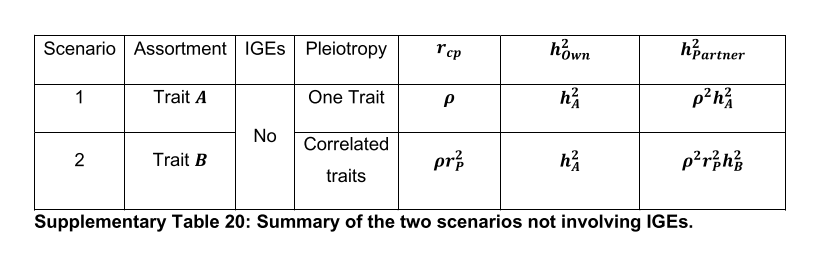
```

---

## Theoretical and simulation study


```{r, out.width='100%', fig.align='center', fig.cap='', echo=F}
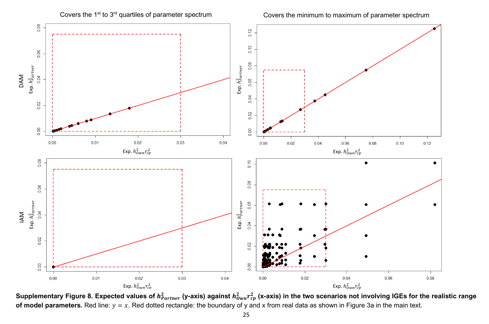
```
  
---

## Theoretical and simulation study


```{r, out.width='100%', fig.align='center', fig.cap='', echo=F}
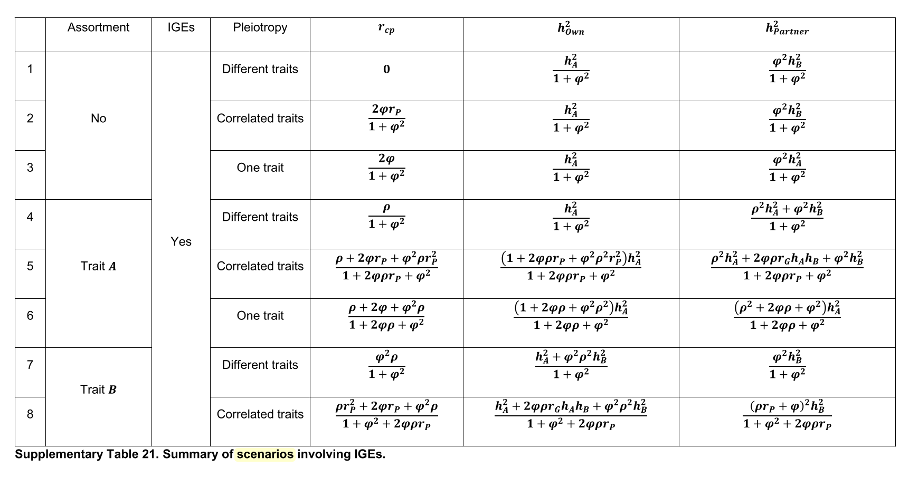
```

---

## Theoretical and simulation study


```{r, out.width='100%', fig.align='center', fig.cap='', echo=F}
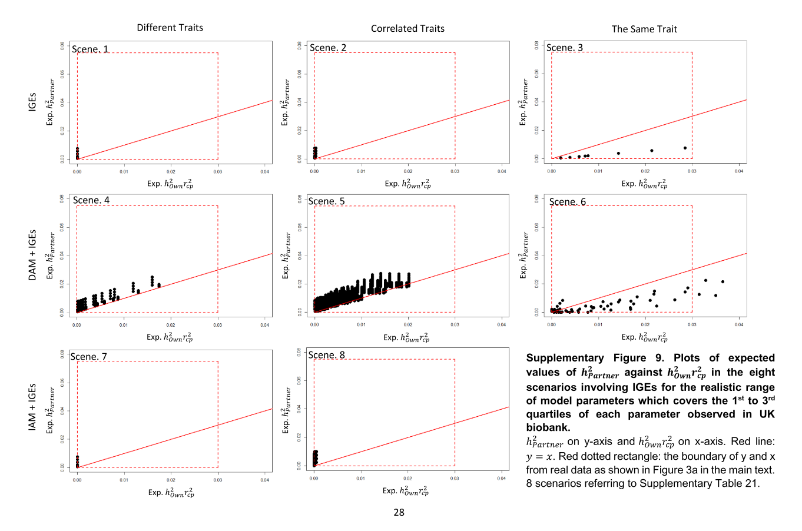
```

---

## Discussion: Summary.

- Investigated 105 traits. 
- Found IGEs are common and present among partners and relatives.
- Presence of IGEs are not simply due assortative mating.
- Results suggest that trait mediating IGEs is unlikely to be the same as the facal trait. 
- Consistent with previous data: 
  - *Kong et al.* found evidence of IGEs for height mediated through direct effects on educational attainment. 
  - *Cheesaman et al.* found no evidence of IGEs for height mediated by direct genetic effects for height. 

```{r, echo=FALSE,out.width="49%", out.height="20%",fig.cap="caption", fig.show='hold',fig.align='center'}
knitr::include_graphics(c('./images/Kong_Nature_Nurture.png','./images/Cheesman_Adopted_Education2.png'))
``` 

---

## Discussion: Future directions and suggestions.

1. Disentangle IGEs from assortative mating:
  - Assortment creates genetic-phenotypic assocation between partners, results in false-discovery of IGEs. 
  - Attempted to whether there is evidence of IGEs on top of assortment.
  - Methods favor identifying instances here the trait mediating IGEs is **different** from focal trait.
  - For this, they suggest longitudinal studies recruiting participants earlier in life.
  
2. Identify genetic variants that mediate the IGEs:
  - Are these the same variants that affect the phenotype.
  - Require larger studies as $h^2_{Partner}$ << $h^2_{Own}$.
  
3. Understand how IGEs mediate trait of interest: 
  - Likely through behavioural changes? 
  - Potential solution to investigate adopted relatives (no relatedness or assortment challenges).
  

---

## Summary of previous analyses. 

- Initial idea was to compare MR using PRS as proxy for phenotype at mate choice (i.e. true assortative mating phenotype).

```{r, out.width='60%', fig.align='center', fig.cap='', echo=F}
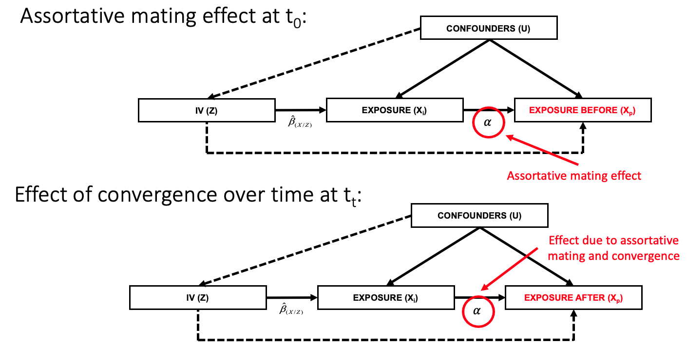
```

- PRS was too weak a proxy to be used as phenotype at mate choice. 
- Assortative mating (AM) MR:
  - In both directions (male to female, and vice versa).
  - Binned by age.
  - Binned by time-together.
  
---

## Summary of status of project. 

```{r, out.width='100%', fig.align='center', fig.cap='', echo=F}
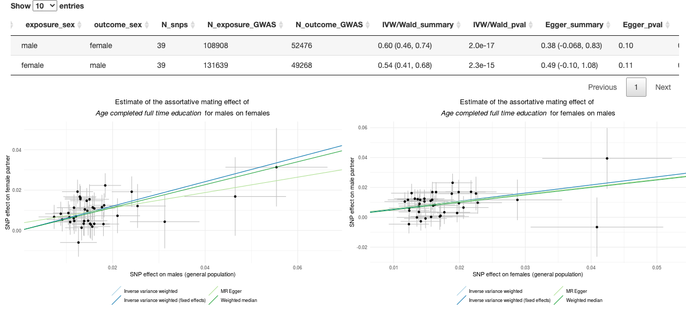
```

---

## Summary of status of project. 

```{r, out.width='100%', fig.align='center', fig.cap='', echo=F}
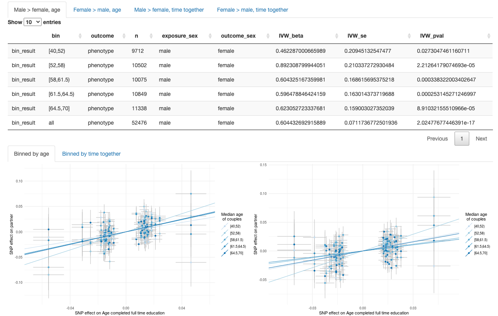
```

---

## Summary of status of project. 

```{r, out.width='100%', fig.align='center', fig.cap='', echo=F}
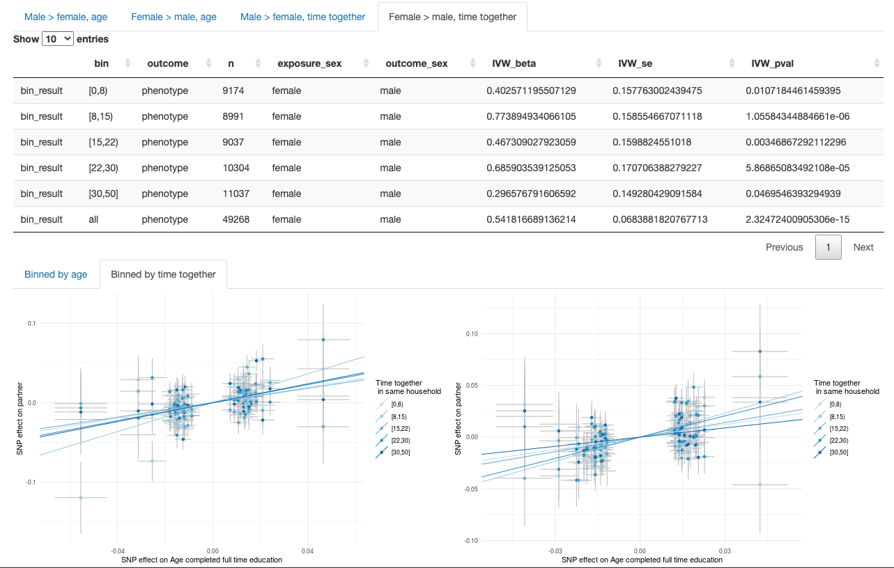
```

---

## Comparison with our analysis. 

- Slightly different couple definitions and filtering (to more closely compare).

- Use MR approach rather than LMM to estimate heritability contribution for both individuals own and partner (i.e. $h^2_{Partner}$ << $h^2_{Own}$).

- Created replication / validation group. 

- Do not consider time together or age of couples (age included as co-variate).

- Our analysis better teases apart the AM (or IGE) effect in males vs females (especially since we are using sex-specific IVs).

- Our analysis better teases out direct AM from indirect?

- Traits analyzed: 
  - To date we have not investigated diet. 
  - We only include traits with observed phenotypic correlation in UKB. 

---

## Next steps. 

1. Compile all various results and (restrict to BF-sig / FDR / nominal results for downstream analyses). 
2. **Which traits have significant differences between age bins?** Run a heterogeneity test between age binned results.
3. **Which traits have significant differences between 'age'time-together bins?** Run a heterogeneity test between time-together binned results.
4. Combine age and time-together bins since these two variables are strongly correlated, so we essentially would have a grid of MR effects with one axis as average age, and the other as time together.
--

5. Employ subset of UKB with multiple time-points to evaluate influence on partners overtime (for significant phenotypes?).
--

6. Current results are all using PHESANT transformed phenotypes, we had discussed running with the raw and ranked phenotypes to see if there is an effect of the INT transformation. 
--

7. **Spatial MR**: do IGEs also extend beyond couples (and siblings?) into neighborhood. *Note: I have already computed distance between each person in UKB*
--

8. Explore dietary traits?
  
---

